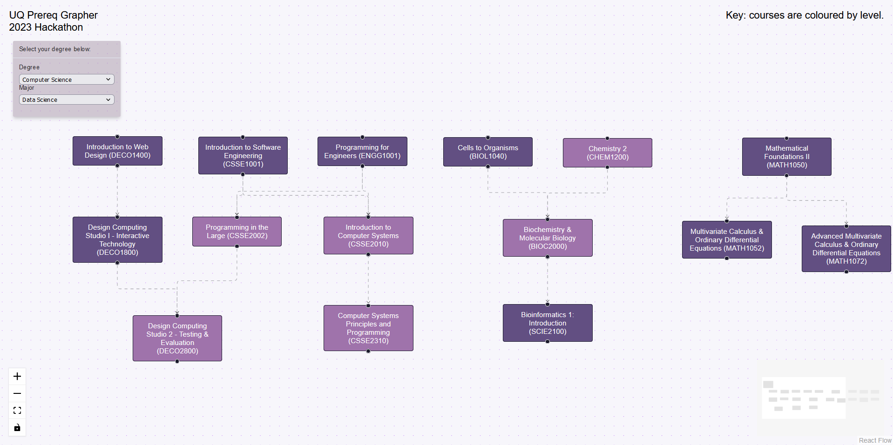

# hackathon_frontend

Frontend to the UQ Prereq Grapher app. 

Built with [React Flow](https://github.com/wbkd/react-flow).

Made in approximately 48 hours during the 2023 UQ Computing Society (UQCS) Hackathon.

Works in conjunction with our [backend](https://github.com/Logan-De-Groot/2023Hackathon/tree/main) repo, which webscrapes The University of Queensland (UQ) website to build a database containing every degree, every associated major, and the prerequisite information for each course within the specified degree/major option.

## Preview

Shown below is a typical prequisite tree, where each course that requires no prerequisite (within the specified degree/major) is shown such that if forms a so-called prerequisite "tree", withing our "forest" of potential course paths.

Note: courses are coloured by course level. Courses are ordered (approximately) from left to right in order of core courses, followed by courses reating to the specified degree major. General course electives are also shown throughout.

